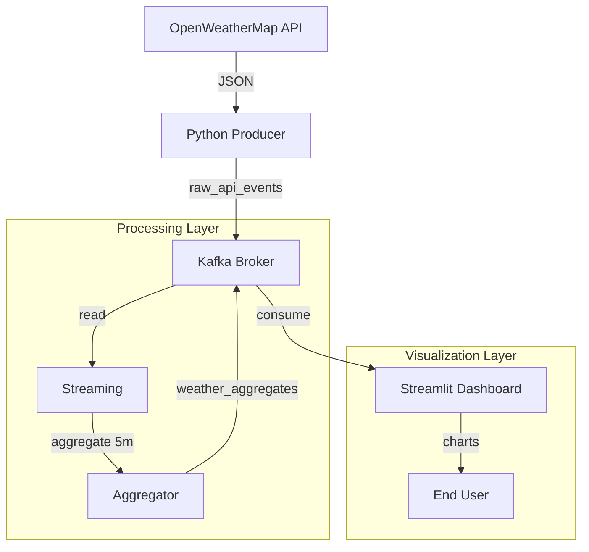

# Real-Time Weather Analytics Dashboard

A complete end-to-end data engineering project that ingests real-time weather data from OpenWeatherMap, processes it with Spark Streaming, and visualizes it on a live Streamlit dashboard.

## 🏗️ Architecture




## 🚀 Key Features

*   **Real-Time Ingestion**: Polls weather data for multiple cities every 15 seconds (configurable via `.env`).
*   **Observability**: Kafka and Spark expose Prometheus metrics; view them at http://localhost:9090.
*   **Stream Processing**: Uses Spark Structured Streaming to calculate rolling averages, min/max temperatures, and wind speeds.
*   **Low Latency**: Optimized for near real-time updates (15s latency).
*   **Data Persistence**: Raw messages are archived under `data/`, and processing state is kept in `checkpoints/` for reliable restarts.
*   **Premium Dashboard**:
    *   **Dark Mode UI** with custom card styling.
    *   **Live Metrics**: Current Temperature, Min/Max (with deltas).
    *   **Interactive Charts**: Temperature trends and High Wind alerts using Plotly.
    *   **City Filter**: Sidebar control to focus on specific locations.
    *   **Auto-Refresh**: Automatically updates as new data arrives.

## 🛠️ Tech Stack

*   **Language**: Python 3.12
*   **Ingestion**: `kafka-python`, OpenWeatherMap API
*   **Message Broker**: Apache Kafka, Zookeeper (via Docker)
*   **Processing**: Apache Spark (PySpark)
*   **Visualization**: Streamlit, Plotly (dashboard now shows average, min, and max temperatures plus wind speed)
*   **Monitoring**: Prometheus scraping Spark & Kafka metrics
*   **Infrastructure**: Docker, Docker Compose (includes Kafka, Zookeeper, Kafka UI, Prometheus for monitoring)

## 📋 Prerequisites

*   Docker & Docker Compose
*   Python 3.12+
*   Java 17 (Required for Spark compatibility)

## ⚡ Quick Start

The easiest way to get everything up and running is the convenience script. It encapsulates all of
our current code changes and handles both infrastructure and application startup in one command.

1.  **Clone the repository** (if you haven't already).
2.  **Create & populate your `.env`**
    ```bash
    cp .env.example .env
    # open .env and set your OpenWeather API key
    # e.g. OPENWEATHER_API_KEY=your_api_key_here
    ```
    Leaving the key empty will cause the producer to log 401 errors and no data will flow.
3.  **(Optional) Activate a Python venv**:
    ```bash
    source .venv/bin/activate
    ```
4.  **Launch the entire pipeline**:
    ```bash
    ./scripts/run_all.sh
    ```

    The script will:
    *   Bring up the necessary Docker services (Kafka & Zookeeper, Kafka UI, Prometheus).
    *   Kick off the API producer in the background.
    *   Start the Spark streaming job that computes rolling averages, min/max and wind alerts.
    *   Open the Streamlit dashboard which now uses `pandas` internally for slick filtering.

5.  **Browse the applications**:
    *   Dashboard – [http://localhost:8501](http://localhost:8501)
    *   Kafka UI – http://localhost:8081
    *   Prometheus – http://localhost:9090
    
By default you rarely need to run `docker compose` yourself; the helper script handles it. If you
do want manual control see the section below.
## 🔧 Manual Setup (Optional)

Should you wish to start pieces by hand or inspect them individually, these are the steps. Note
that the helper script above is the recommended path and will execute these same commands for you.

1.  **Bring up the infrastructure**: the `docker-compose.yml` file defines Kafka, Zookeeper, Kafka
    UI and Prometheus.
    ```bash
    docker compose -f docker/docker-compose.yml up -d
    ```

2.  **Producer** – ensure your virtualenv is active and then run:
    ```bash
    source .venv/bin/activate
    python src/ingestion/api_producer.py
    ```

3.  **Spark Streaming** – the processor emits averages, min/max values, and high‑wind alerts:
    ```bash
    source .venv/bin/activate
    python src/processing/streaming_app.py
    ```

4.  **Dashboard** – relies on `pandas` for filtering and formatting:
    ```bash
    source .venv/bin/activate
    streamlit run src/dashboard/app.py
    ```

You only need Docker Compose if you're managing the container services yourself; otherwise the
`run_all.sh` script handles the orchestration end‑to‑end.

## 📂 Project Structure

The codebase is deliberately small and modular – each major subsystem lives under `src/`.

```
├── docker/
│   └── docker-compose.yml   # Kafka, Zookeeper, Prometheus, Kafka‑UI
├── scripts/
│   └── run_all.sh           # Single‑command orchestration of containers & Python services
├── src/
│   ├── dashboard/
│   │   └── app.py           # Streamlit dashboard (uses pandas for data munging)
│   ├── ingestion/
│   │   ├── api_client.py    # OpenWeatherMap REST client
│   │   └── api_producer.py  # Kafka producer with polling loop and graceful shutdown
│   └── processing/
│       └── streaming_app.py # Spark job with bronze/gold lakehouse, min/max metrics, and
│                              # Prometheus configuration
├── librairies/              # External JARs required by Spark/Kafka
├── data/                    # Bronze parquet storage (raw events preserved)
├── checkpoints/             # Spark state & Kafka offsets for resilient restarts
├── screenshots/             # Example dashboard images for documentation
├── .env                     # Runtime configuration (API keys etc.) – ignored by Git
├── .env.example             # Template for environment variables
└── requirements.txt         # Python dependencies (listed for virtualenv)

## 🔒 Security

This project uses environment variables to manage sensitive information like API keys.

1.  **Do not commit your `.env` file**. It is included in `.gitignore` by default.
2.  **Use the template**: A `.env.example` file is provided.
    ```bash
    cp .env.example .env
    ```
    Then, edit `.env` and add your actual API keys. At minimum you must populate `OPENWEATHER_API_KEY`. If this value is empty the producer will log 401 errors (see `producer.log`) and the dashboard will not receive any data.
3.  **Restart services** after modifying the `.env` file so that the producer picks up the new values.
```
